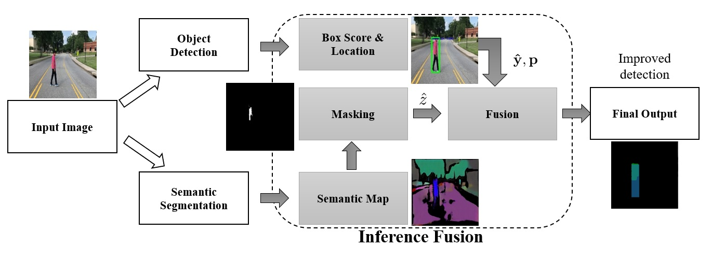

# InferenceFusion
Pedestrian detection for autonomous cars using inference fusion of deep neural networks. This method provides joint prediction with asymmetric multiple networks by fusing pair-wise pixel relevant information. 

## Features 
This method has following adavantages:
  * **Modularity:** our framework offers a modular structure where many object detection and semantic segmentation networks can be adopted, enabling iterative development and testing. 
  * **Parallelism:** our framework can operate anchor box detection and semantic segmentation networks in parallel, resulting in better runtime efficiency.  
  * **Scalability:** our framework can also obtain higher runtime efficiency by combining relatively less complex networks.     
  * **Robustness:** our framework allow combining relatively less complex networks which can jointly provide more robust  performance at a reasonable runtime efficiency.
  * **Maintainability:** Due to the modular structure of our framework facilitates the process of adding or removing networks for different scenarios (e.g., crowded environments, highway environments, intersections, etc).

## Architecture 
An input image is fed into the object detection branch and semantic segmentation branch simultaneously. The output of the semantic map is masked for pedestrian instances and mapped into the detected bounding boxes from the object detection network. The inferences of both networks are fused based on the consensus on detected pedestrians.
 


## Folder Organization 
```
project
│   README.md
└───detetectors
│         └───[Pedestron](https://github.com/hasanirtiza/Pedestron)
│         └───[TensorFlow Model Garden](https://github.com/tensorflow/models)
│         └───[YOLOv5](https://github.com/ultralytics/yolov5)
└───evaluation
│         └───mAPCpp
└───datasets 
│    └─── Greensboro
│    |       └───image
│    |       └───label
│    └─── CityPersons
│            └───image
│            └───label
└───fusion++
└───fusion
└───semantics
│      └───[semantic-segmentation](https://github.com/sithu31296/semantic-segmentation)
│      └───Pix2PixGAN
└───results
│   └───all_baseline_results 
│   |       └───Greensboro
│   |       └───CityPersons
│   └───all_fusion_results 
│   |       └───Greensboro
│   |       └───CityPersons
│   └───all_baseline_results.json 
│   └───all_fusion_results.json     
```


## Dependency 
* Ubuntu 
* Docker 
* CUDA 
* Python with pip
* [Pedestron](https://github.com/hasanirtiza/Pedestron)
* [TensorFlow Model Garden](https://github.com/tensorflow/models)
* [RetinaNet](https://github.com/fizyr/keras-retinanet)
* [semantic-segmentation](https://github.com/sithu31296/semantic-segmentation)
* [Pix2PixGAN](https://machinelearningmastery.com/how-to-develop-a-pix2pix-gan-for-image-to-image-translation/)
* [SharedArray](https://pypi.org/project/SharedArray/)
### Build Object Detection Branch 
Navigate to detectors folder and run the __install.sh__ file.
After that download pretrained weights by running __download.sh__ file 

### Build Semantic Segmentation Branch 
Navigate to semantics folder and run the __install.sh__ file.
After that download pretrained weights by running __download.sh__ file 


## Getting Started (Demo)

Inference fusion can be evaluated on sample images in the following way
```bash
    cd fusion && ./run.sh 
```
This will run pix2pixGAN and MGAN parallely. We need to ensure availability of two GPUs.
In our case, we have 4 GPUs setup and the docker container uses __0,1,3__ GPUs and Pix2PixGAN 
uses GPUs 2. We can change the GPU using __CUDA_VISIBLE_DEVICES=2__
## Dataset Pre-trained weights
* Renamed [CityPersons](https://bit.ly/3rdugKq) test dataset.
* [Greensboro](https://bit.ly/3GpTtaS) Dataset
* Pre-trained weights of [Faster RCNN, SSD MobileNet v1, SSD MobileNet FPN, RetinaNet](https://bit.ly/3qoFvAt) models.
## Evaluation 
For benchmark and evaluation, we modify [mAP](https://github.com/Cartucho/mAP) repository.
We use following evaluation metrics 
* mAP
* log average miss rate
* miss-rate vs FPPI plots. 

## Benchmarking 

To benchmark with exiting networks, we need to follow the following procedues
1. prepare the dataset and ground truth labels in txt format. We can convert ground truth from xml to txt by modifying [this](https://github.com/Cartucho/mAP/blob/master/scripts/extra/convert_gt_xml.py) script.
2. run the object detectors, an example can be found __detectors/runObjectDetection.sh__ file. This script is based on Pedestron docker container that we locally built. This will generate detection results in txt files and save the results in a given output directory.
3. run the semantic segmentation networks. Here we provide pix2pixGAN based semantic segmentation network, an example can be found under __semantics/test_pix2pix.py__

### How to utilize existing semantic segmentation results

To save time, it is better to save semantic segmentation results in pkl file and later fuse it with object detection branch. 
```python
import pickle
import re 
import os 
from pathlib import Path

results = {}
# read all images from data folder 
for indx, filename in enumerate(Path(dataset).glob('*.*')):
    # extract integer index from each filename 
    nameId = int(re.findall(r'(\d+)', os.path.basename(filename.name))[0])
    #TODO implement get_pedstrians() function
    # get pedestrian mask by running semantic segmentation branch 
    # semantic segmentation provides a lot of information, we are only interested in pedestrians.
    # By defining the lower and upper values of HSV we can get pedestrian mask.
    # Here is an example (https://www.geeksforgeeks.org/opencv-invert-mask/)
    ped_mask, imgDim = get_pedstrians(str(filename))
    # populate the dictionary using mask and original image dimension. 
    # Note that mask dimesnion might be much smaller than original image diemension. 
    # It is important to know original image dimension for fusing purpose
    results[nameId] = {"mask":ped_mask, "ori_dim":imgDim}

# save the dictionary in pkl file. 
with open('sem_map_pix2pix_greensboro.pkl', 'wb') as handle:
    pickle.dump(results, handle, protocol=pickle.HIGHEST_PROTOCOL)
```

### Run inference fusion 
Now that we have both results from object detection and semantic segmentation networks, we can 
fuse these information using inference fusion which is located under __fusion/main.py__. 
```bash
cd fusion 
python main.py --target ../results/mgan --smap 'sem_map_pix2pix_greensboro.pkl' --output ../result/mgan
```
where, 
* smap - saved semantic segmentation results in pkl format
* target - saved object detection results in txt format 
* output - will generate txt file in output directory 

Once we have inference fusion results, we can evaluate our results by running __evaluation/benchmark.py__ script as follows
```bash
cd evaluation 
python benchmark.py 
```
Please specify appropriate GROUND_TRUTH and detection results directories in  __evaluation/benchmark.py__ script.
